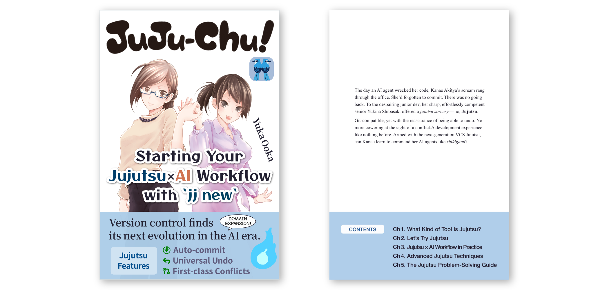

# _Juju-chu! Start Your Jujutsu × AI Workflow with `jj new`_ Support Page

This repository provides sample code, errata, and update information for _Juju-chu! Start Your Jujutsu × AI Workflow with `jj new`_.

 

## ■ About the Book

### Overview

_Juju-chu! Start Your Jujutsu × AI Workflow with `jj new`_ is a full-scale beginner’s guide to **[Jujutsu](https://www.jj-vcs.dev/)**, the next-generation VCS that has been gaining rapid attention.

The book covers not only basic usage, but also how to build a mental model of Jujutsu by comparing it with Git, practical tips for working with AI coding agents, and solutions to common problems you are likely to encounter when using Jujutsu in real projects.

By the end of the book, you will be ready to start using Jujutsu right away and apply it to AI-assisted development.

### Free Sample

A free sample PDF is available for preview. Feel free to take a look before reading the full book.

- [Free sample PDF](./jujuchu-sample.pdf)
- [Free sample EPUB](./jujuchu-sample.epub)

 

## ■ Sample Code

The source code for the configuration examples shown in the book is available in the following directories:

- Configuration examples from Chapter 3: [`./samples/ch3/`](./samples/ch3/)
- Configuration examples from Chapter 4: [`./samples/ch4/`](./samples/ch4/)

 

## ■ Errata and Updates

The digital edition is updated as needed. If you purchased the digital edition, please download the latest version from the store where you bought it.

For errata and update information corresponding to the print edition, please check the printing information in the colophon of your copy and refer to the page below.

- [Errata and updates](./errata.md)

 

## ■ Table of Contents

#### Preface

#### About This Book

#### Prologue

#### Chapter 1: What Kind of Tool Is Jujutsu?

- 1-1. Is Git a poor fit for agentic development?
- 1-2. Why Jujutsu is gaining attention in the AI era
- Column: How Git Revolutionized Version Control

#### Chapter 2: Let’s Try Jujutsu

- 2-1. Setting up Jujutsu
- 2-2. A hands-on tour of Jujutsu
  - 2-2-1. Initializing a repository
  - 2-2-2. Checking the repository’s state
  - 2-2-3. Working with changes
  - 2-2-4. Working with remotes
- 2-3. Jujutsu’s three logs
  - 2-3-1. Revision Log (`jj log`)
  - 2-3-2. Evolution Log (`jj evolog`)
  - 2-3-3. Operation Log (`jj op log`)
- 2-4. Jujutsu’s mental model
  - 2-4-1. What is a change?
  - 2-4-2. The difference between branches and bookmarks
  - 2-4-3. Working on anonymous branches
- 2-5. Commonly used `jj` commands
- Column: Jujutsu’s Roots—What Kind of VCS Is Mercurial?

#### Chapter 3: Practical Jujutsu × AI Workflows

- 3-1. Coordinating AI agents with Jujutsu
  - 3-1-1. Getting AI agents to use Jujutsu
  - 3-1-2. Permissions settings for `jj` commands
  - 3-1-3. Running `jj fix` with hooks
- 3-2. A practical development process with Jujutsu and AI
  - 3-2-1. Adjusting the granularity of AI-generated changes
  - 3-2-2. Pushing changes and creating a PR
  - 3-2-3. Parallel development with workspaces
- Column: The Tools That Shaped Jujutsu, Part 1

#### Chapter 4: Advanced Jujutsu Techniques

- 4-1. Smarter ways to specify targets
  - 4-1-1. Using revsets to specify revisions smartly
  - 4-1-2. Using filesets to specify files smartly
- 4-2. Handy advanced commands
  - 4-2-1. `jj absorb`
  - 4-2-2. `jj arrange`
  - 4-2-3. `jj bookmark advance`
- 4-3. Alternatives to Git hooks
- 4-4. Resolving Conflicts Semi-Automatically
  - 4-4-1. Mergiraf
  - 4-4-2. Weave
- 4-5. Jujutsu UI tools
  - 4-5-1. jjui
  - 4-5-2. JJ View
- Column: The Tools That Shaped Jujutsu, Part 2

#### Chapter 5: Jujutsu Problem-Solving Guide

- 5-1. FAQ
  - 5-1-1. Comparing Jujutsu with Git
    - What can Git do that Jujutsu cannot?
    - Why is there no `merge` command?
    - Why is there no `pull` command?
    - How do I do the equivalent of Git’s cherry-pick?
  - 5-1-2. Niche operations and settings
    - Can I view the contents of a file at a specific point without moving `@`?
    - Can I split a change chronologically?
    - How do I keep temporary logs, dumps, and other files out of history?
    - Can I store repository-specific Jujutsu settings in the repository itself?
    - How do I rename a tracked bookmark?
  - 5-1-3. Jujutsu trivia
    - Is Jujutsu just a wrapper around Git?
    - What kind of person created Jujutsu?
    - Does the product name mean “cursed technique” or “jujutsu” as a martial art?
- 5-2. Troubleshooting
  - An ordinary push unexpectedly turns into a force push
  - The mysterious “Error: The working copy is stale” message appears
  - A change suddenly has a `divergent` annotation
  - Jujutsu is not tracking image or video files
  - After merging a PR and fetching, `@` gets lost
  - A remote bookmark still in progress was deleted on GitHub
  - Claude Code still asks for permission even though `jj log` is allowed in Permissions
- Column: We Want a JJ-Native Hosting Service!

#### Epilogue

---

© 2026 Yuka Ooka / [Klemiwary Books](https://klemiwary.com/)
